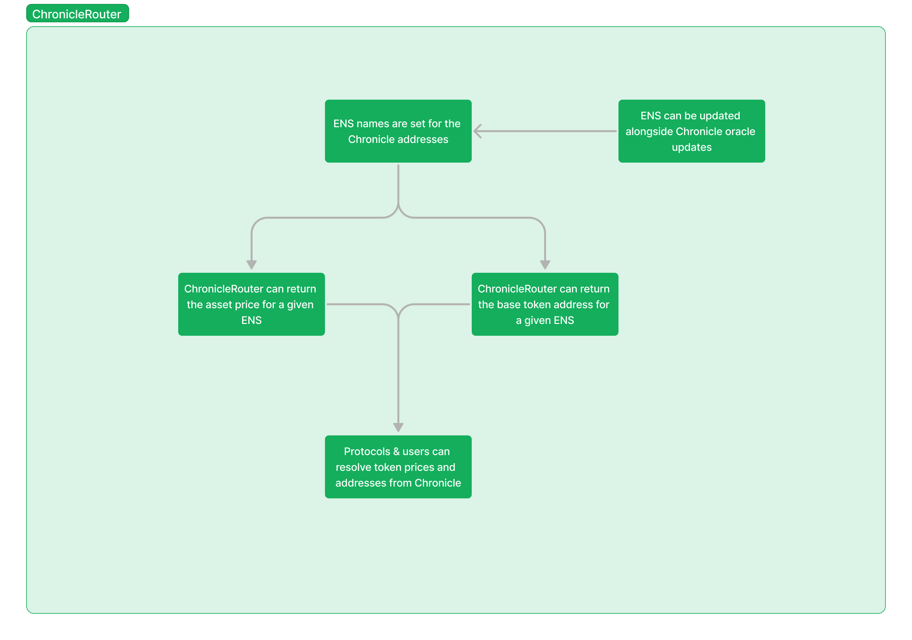

# ChronicleRouter

ChronicleRouter is a custom router that uses ENS to make using Chronicle easier for both us and any other protocol that would like to implement Chronicle price feeds.

We sought to solve some inefficiencies we encountered when implementing Chronicle’s price feeds, mainly being 1) having the contract know what the appropriate price feed is to use, and 2) having the contract know what token address corresponds to what price feed.

Initially we approached this by having mappings between the appropriate token addresses and price feeds in our contract, but decided to implement a custom router for Chronicle that leverages ENS to allow other integrators to use Chronicle more effectively.

Each Chronicle’s oracle addresses have a registered ENS subdomain to make this process easier (ex. ETHUSD.cob.eth for the ETH/USD price oracle).

In the ChronicleRouter contract, there are a few main public functions that other integrators can use:

1. namehash()
    1. Returns the ENS name hash for a given pair
2. getToken()
    1. Returns the token address for a given pair
3. query()
    1. Returns the pricing information from the Chronicle oracle for a given pair
  
Utilizing ENS for this router also future proofs contract implementations using Chronicle, as if there are updates to the oracle contract addresses, the new addresses can be updated as the ENS resolved address.
