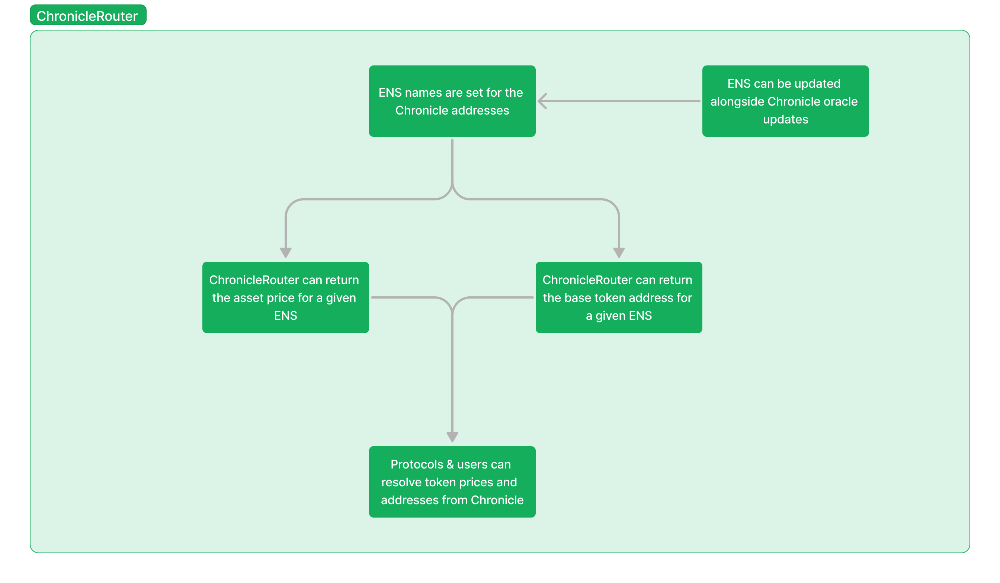

# CoB (Coincidence of Bridging)

P2P cross chain asset transfers and swaps using Hyperlane and Chronicle. Reducing bridge risks and fees.

### The problem with existing bridges

As we enter a increasingly multichain space, it is crucial to have a reliable method to transfer funds between chains. However, most existing token bridges are extremely prone to vulnerabilities that can lead to the loss of funds.

In the past two years alone, there has been over $2.6b of funds stolen through bridge hacks. CoB aims to solve this by providing a secure and extremely inexpensive method of bridging: by finding Coincidences of Bridging between users on different chains.

### How CoB works

CoB can be utilized for both cross chain asset transfers and cross chain swaps through finding Coincidence of Bridging between users. When users submit orders to CoB, CoB will match these orders between users, utilizing Hyperlane to communicate these orders between chains. For cross chain swaps, the swap rate is determined using Chronicle, ensuring a verifiably fair price for users.

At the core of an order there are several components:

- sourceId
    - ID of the order on the  fromChain
- sender
    - address of msg.sender, will be the same address to receive on toChain
- fromToken
    - address of token the sender is sending
- toToken
    - address of token the sender is receiving
- amountIn
    - uint256 of amount of tokens sender is bridging
- amountOut
    - uint256 of amount of tokens sender is receiving
    - IF fromToken = toToken
        - amountOut = amountIn
    - ELSE
        - amountOut = oraclePrice(toToken/fromToken) * amountIn
- fromChain
    - uint256 of chainId the sender is sending tokens from
- toChain
    - uint256 of chainId the sender is receiving tokens from
- deadline
    - uint256 of block number the order should be filled by
- maxSlippage
    - uint256 of max delta between amountIn and amountOut acceptable else reverts
- filled
    - bool if an order is filled
- fillers
    - Array of addresses that filled the order
- fills
    - Mapping of addresses that filled the order to amount they filled

When this order is submitted to CoB, the contract first checks if the order can be filled against existing pending orders. If yes, the order will attempt to fill as many orders as it can, with the filled order tokens sent to the respective parties on their respective chains. After this is complete, or in the case where there were no pending orders available, a message is broadcasted to the destination chain using Hyperlane where they become a pending order until another coincidence of bridging is found.

Additionally, for cross chain swaps, CoB utilizes a custom router contract that we built to resolve asset pair prices through ENS & Chronicle. For example, when a user wants to perform a cross chain swap of ETH to USDC, the router will fetch the Chronicle pricing of this pair through ETHUSDC.cob.eth. The price fetched from Chronicle is then used for the exchange rate between the two assets. For more information on this Chronicle x ENS router, see [this document](/ChronicleRouter&ENS.md).

### Tech stack

Hyperlane: CoB utilizes Hyperlane to pass the orders to and from the destination chains. Whenever a user submits an order, the order information is broadcasted to the appropriate chain to await a coincidence of bridging. After a coincidence of bridging is found, the updated order information is passed back to the origin chain, allowing the respective canonical assets are sent between users.

Chronicle: CoB utilizes Chronicle to determine the exchange rate between assets for cross chain swaps. To ensure cross chain swaps between users remain as inexpensive and trustless as CoB’s standard cross chain transfers, Chronicle’s price feeds are used for the asset pricing, and thus swap rate. Additionally, we created a custom router for Chronicle that uses ENS to make using Chronicle more efficient for both us and any other protocol that would like to implement them.

ENS: CoB utilizes ENS to streamline the process of retrieving the price data from Chronicle through using ENS’ subnames for the price feed addresses (ex. ETHUSDC.cob.eth is Chronicle’s ETH/USD price feed).

### Try it out
